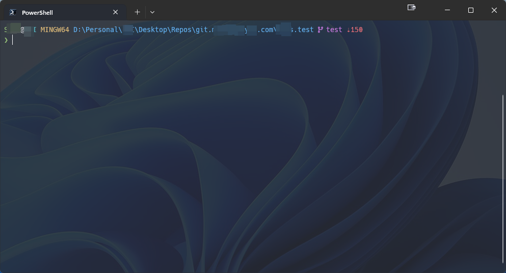

# FastPrompt

🚀 一个极速、简洁、支持 Git 状态的 PowerShell 提示符，专为开发者设计。  
支持 PowerShell 7、Windows Terminal 和 Nerd Fonts。

> 旨在提供快速、简洁且实用的终端提示符，加载迅速且无额外依赖。

---

## ✨ 特性

- ⚡ 超快加载，免除外部工具
- 🧠 Git 状态：分支名称、ahead/behind、脏目录（dirty）状态
- 🎨 简洁现代的 Nerd Fonts 样式
- 🔧 易于自定义和扩展
- 🧱 打包为可重用的 PowerShell 模块 (`FastPrompt.psm1`)

---

## 🔧 安装

1. 克隆仓库：

```powershell
git clone https://github.com/your-username/FastPrompt.git
```
2. 手动导入模板

```powershell
Import-Module "$PWD/FastPrompt/src/FastPrompt.psm1" -Force
```
3. （可选）将导入语句添加到 PowerShell 配置文件中以实现自动加载：
```powershell
'Import-Module "D:\Path\To\FastPrompt\src\FastPrompt.psm1" -Force' | Out-File -Append $PROFILE
```
## 🖼️ 提示符预览


## 📁 项目结构

```css
FastPrompt/
├── src/
│   ├── FastPrompt.psm1
│   └── FastPrompt.psd1
├── media/
│   └── screenshot.png
├── README.md
├── LICENSE
└── .gitignore
```
